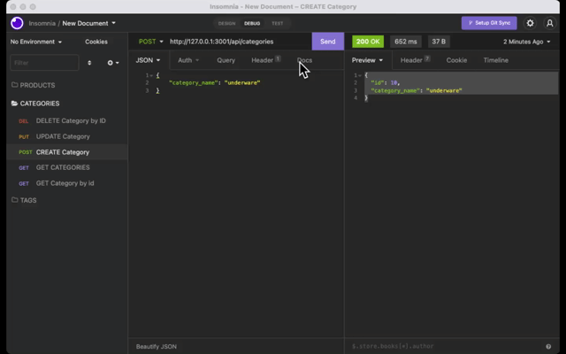

# E-commerce Back End
This is a e commerce back end application based on node.js and sequelize.

### Github : https://github.com/fumixer/E-commerce-Back-End

### Workthrough video : 

### Screenshot

### Technologies
* node.js
* npm
* dotenv
* express
* mysql2
* sequelize

